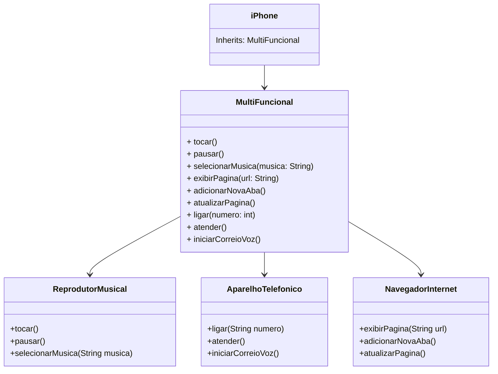

## POO - Desafio

### Modelagem e Diagramação de um Componente iPhone

Desafio Diagramação de um Componente iPhone

### Diagrama UML

MultiFuncional implementa todas as interfaces (AparelhoTelefonico, NavegadorInternet, e ReprodutorMusical).
Iphone estende MultiFuncional, herdando suas funcionalidades.
