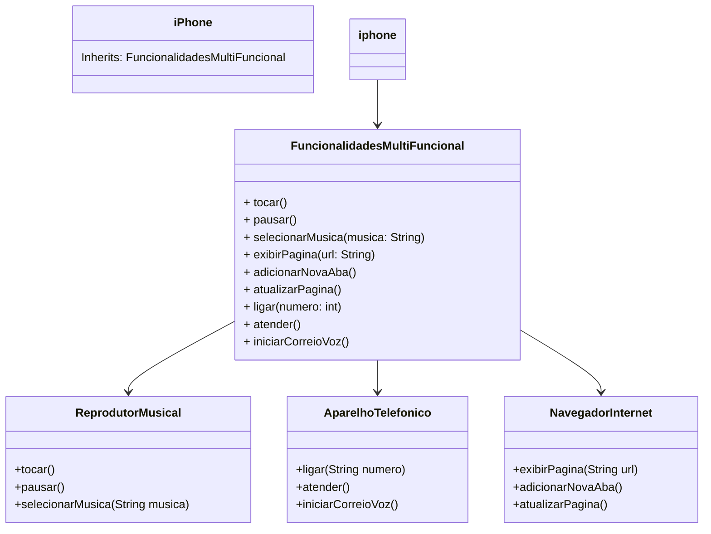

## POO - Desafio

### Modelagem e Diagramação de um Componente iPhone

Desafio Diagramação de um Componente iPhone

### Diagrama UML

FuncionalidadesMultiFuncional implementa todas as interfaces (AparelhoTelefonico, NavegadorInternet, e ReprodutorMusical).
Iphone estende FuncionalidadesMultiFuncional, herdando suas funcionalidades.